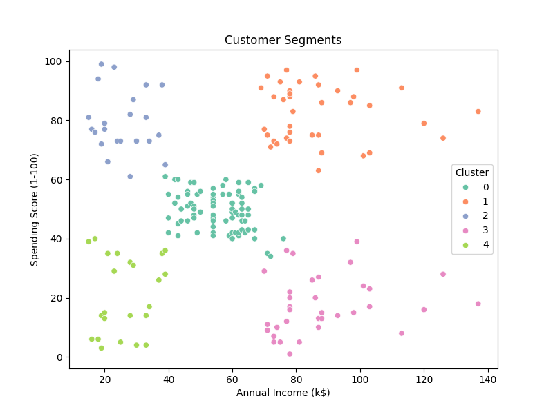
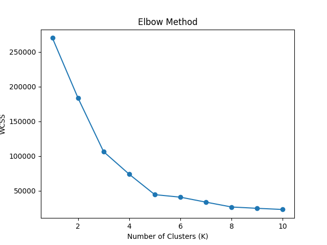
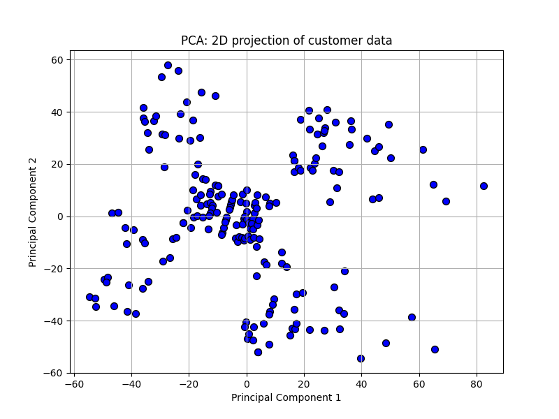

# K-Means Clustering - Mall Customer Segmentation

## Objective
Perform unsupervised learning using **K-Means Clustering** on a customer segmentation dataset. The task involves data preprocessing, dimensionality reduction using PCA, clustering with K-Means, evaluation using Silhouette Score, and visualization.

---

## Tools & Libraries Used
- Python
- Pandas
- Scikit-learn
- Matplotlib
- Seaborn 

---

## Key Steps
1. Loaded dataset of mall customers.
2. Used Elbow Method to find optimal number of clusters.
3. Applied KMeans and visualized clusters.
4. Evaluated performance using Silhouette Score.

---

## Result
- Optimal K: 5
- Silhouette Score: 0.55

---

## How to Run
1. Clone the repository.
2. Open the Jupyter Notebook: `clustering_kmeans.ipynb`
3. Run all cells to see step-by-step execution and outputs.

---

## Plots

---

## Questions & Answers

### 1. How does K-Means clustering work?
K-Means is an unsupervised learning algorithm used to partition a dataset into **K distinct clusters**. The algorithm works as follows:
- Initialize K centroids randomly.
- Assign each data point to the closest centroid based on Euclidean distance.
- Update the centroids by calculating the mean of all data points assigned to each cluster.
- Repeat the assignment and update steps until the centroids no longer move significantly or a maximum number of iterations is reached.

---

### 2. What is the Elbow Method?
The **Elbow Method** helps determine the optimal number of clusters (K) in K-Means. It involves:
- Running K-Means with different values of K.
- Plotting the **inertia** (sum of squared distances from points to centroids) for each K.
- Identifying the "elbow point" in the plot, where the rate of decrease sharply slows down — this point suggests a good balance between model performance and complexity.

---

### 3. What are the limitations of K-Means?
- **Requires specifying K** in advance.
- Assumes clusters are spherical and equally sized, which may not match real-world data.
- **Sensitive to outliers** and noise.
- Performance heavily depends on the initial centroid selection.
- Not suitable for identifying non-convex or complex-shaped clusters.

---

### 4. How does initialization affect results?
K-Means is sensitive to how the initial centroids are chosen. Poor initialization can lead to:
- Sub-optimal clustering.
- Slow convergence.
- Getting stuck in local minima.

To mitigate this, **KMeans++ initialization** is commonly used, which spreads out the initial centroids more effectively.

---

### 5. What is inertia in K-Means?
**Inertia** is the sum of squared distances between each point and the centroid of the cluster it belongs to. It measures the compactness of the clusters:
- Lower inertia means tighter clusters (better).
- Used in the Elbow Method to choose the best K.

---

### 6. What is Silhouette Score?
The **Silhouette Score** evaluates clustering quality. It considers both:
- **Cohesion** (how close each point is to others in its cluster).
- **Separation** (how far it is from points in other clusters).

The score ranges from **-1 to 1**:
- A score close to **1** indicates well-defined clusters.
- A score near **0** indicates overlapping clusters.
- A negative score suggests wrong cluster assignment.

---

### 7. How do you choose the right number of clusters?
You can determine the optimal K using:
- **Elbow Method**: Find the point where inertia stops decreasing significantly.
- **Silhouette Score**: Maximize the score for better separation and cohesion.
- **Domain Knowledge**: Sometimes prior understanding of the data helps.

---

### 8. What’s the difference between clustering and classification?
- **Clustering** is unsupervised learning — the algorithm groups data without labeled outputs.
- **Classification** is supervised learning — it assigns predefined labels to input data based on training.

In clustering, we discover structure; in classification, we predict known outcomes.
